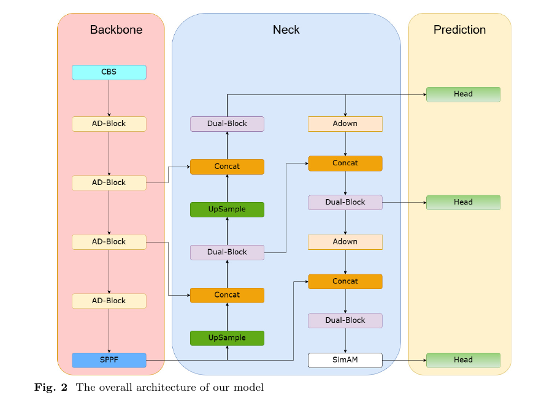

# EGCD-YOLO

## Graphic Abstract


## Overview
EGCD-YOLO is an advanced real-time garbage classification detector designed to accurately identify and classify waste with high efficiency. It ensures both real-time processing and precision, making waste detection smarter and more reliable.

## Dependencies
- Python 3.8
- PyTorch 2.4
- numpy
- pandas
- matplotlib

## Setting
- Epochs:400
- Batch size:16
- lr0:0.01
- lrf:0.01
- Momentum:0.937
- Weight-decay:$5 \times 10^{-4}$
- input image size:640×640
- Optimizer:SGD
- iou:0.7
- Data augmentation:Mosaic

## Tip
The main configuration file is in the ultralytics/cfg/models/v8 folder.The yaml file for EGCD-YOLO is in there!You can modify the file you want to run with yolov8-train.py.


## Usage
```bash
python yolov8-train.py
```


